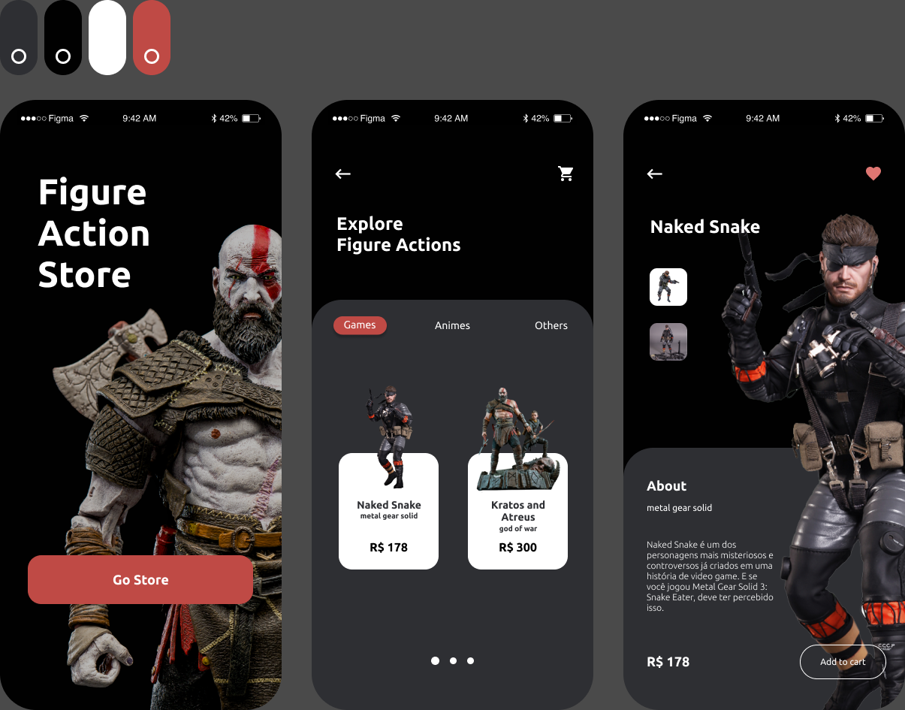
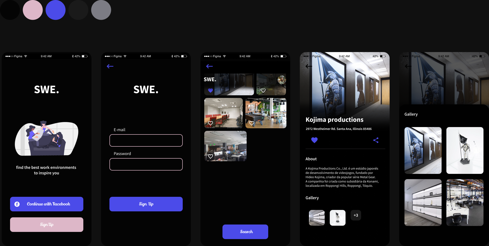

# Interface Templates - React Native

this project aims to develop several types of interface models in react native.

---

| Project | Preview | Screens | Estimation | Status |
| ------ | :------: | :------: | :------: | :------: |
| [Figure Action Store](https://www.figma.com/file/jPqNLLlpSPDGnQOYMcRY8F/interfacetemplates-figureaction-store?node-id=0%3A1) |  | 3 | ~10 hours | :white_check_mark: |
| [Share Work Environments](https://www.figma.com/file/l7WLsdpRLLY1UyGmjR1EJ6/interfacetemplates-share-work-environments?node-id=0%3A1) |  | 6 | ~16 hours | :white_check_mark: |

---

  

### 📌 Support

Please contact me at one of the following places!

- Instagram on [@marlomarquesbr](https://www.instagram.com/marlonmarqsbr/)
- Linkedin [Marlon Marques](https://www.linkedin.com/in/marlon-marques-0b509813b/)
